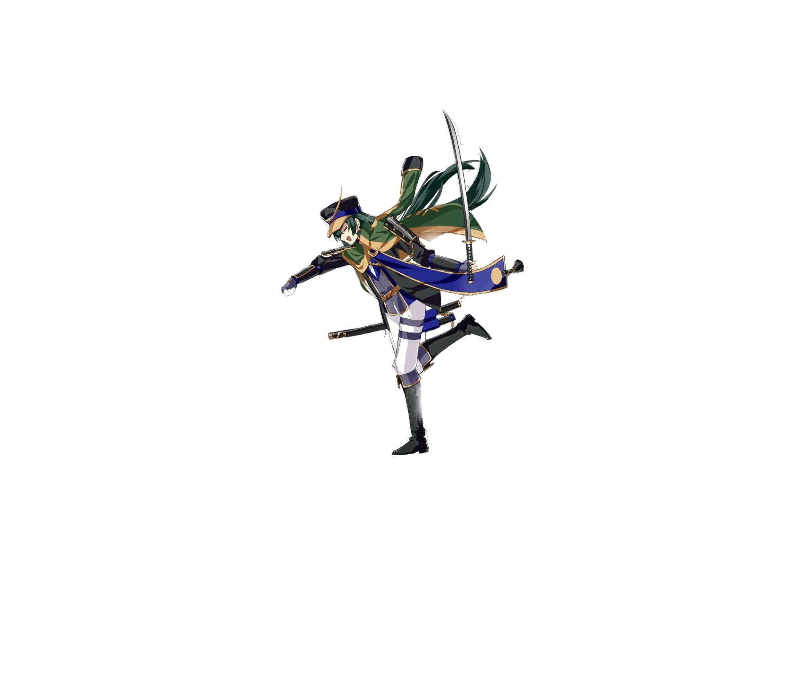
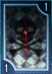
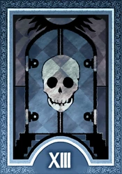

# Project Overview

The theme of the game is to stop the enemy from taking over the  Odawara castle in a seige. The player will be a archer who will be firing arrows or firing their Bo-Hiya. The enemies will be using their deku leaves in order to float down and attack you they will also be using arrows.
## New gameplay 

Multiple weapons including bows and Bo-Hiya, the Bo-Hiya will be used for three shots and will then break. There will be a proper level system in which case when certain points are reached the boss enemy will appear, there will be 15 levels in total in which case the 15th level will be the final boss stage in which case if you win then you go to the win screen.
 
 ### Special enemy/Boss 
 There will be a special enemy who will shot fire arrows do more damage to barriers.There is a boss enemy who will have 10hp for basic weapons and is immune to all power ups, He will shoot fast but he won't one shot the player as it will take 3 shots.
 
 


#### Power Ups
 There are 3 powerups, one for getting the Bo-Hiya the weapon will be placed on the screen in which case the player could then grab it, the second one will be called "Armageddon" in which all of the enemies  minus the boss and the special will die it will be charcterized with a door with a skull on it and the roman numerals for 13. The third Powerup is called "all at once" in which all of the enemies shoot at once, it is characterized by a sword covered by a black skull. 



# Behaviour - User Journey


# Project Plan 
 ``` mermaid 
gantt
     title Seige of Odawara Castle Project Plan
     dateFormat DD-MM-YY
     axisFormat %d-%B
     tickInterval 3week

     section Design 
     Project Overview:20-04-23, 7d
     Project Plan:27-04-23, 7d
     
     section Implemtation
     Boss/Special:07-05-23, 6d
     Powerups:13-05-23, 2d
     UI:04-05-23, 3d
     Find suitable Images:13-05-23, 1d 
     Levels:15-05-23, 5d
     Testing:01-05-23, 07-06-23
     Final Submission:07-06-23, 1d
```

```mermaid 
journey 
title Gameplay
    section Main Menu 
        Load up game: 3 Menu screen: 
        Look at options (optional): Option menu:
        Click on play game: load main game screen:  
    section Main game 
        Main game loads: Player starts moving
        Enemy moves and shoots: Player starts dodging and firing back 
        stage completed: next stage starts up  
    
    section game end 
        load up win screen: lose screen if they lost 
        Return to main menu: Play again?
        Quit out if they don't want to play anymore: 

